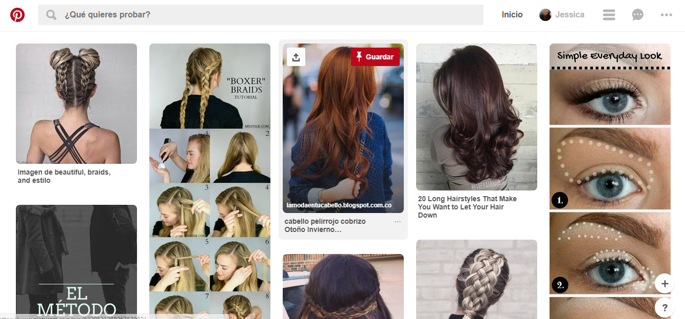
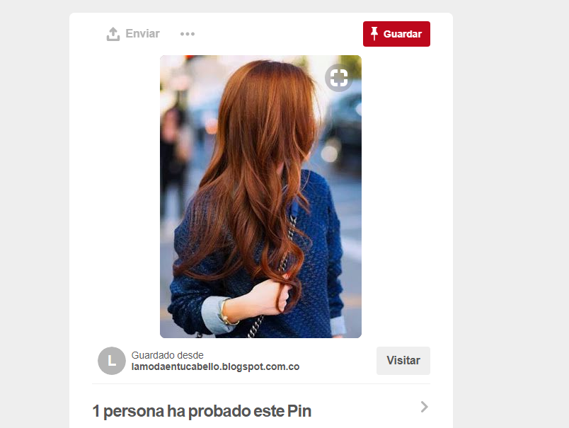
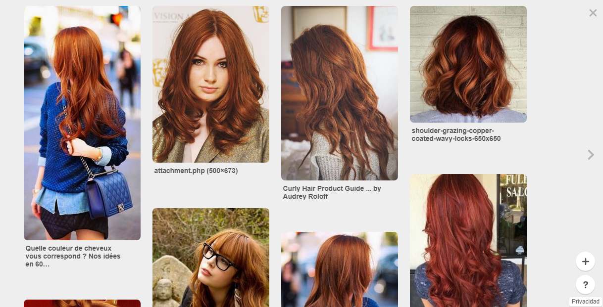
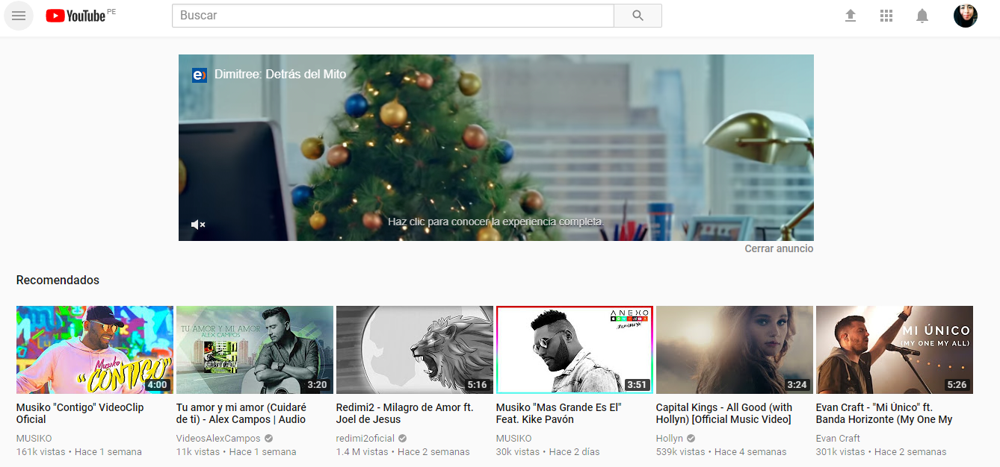
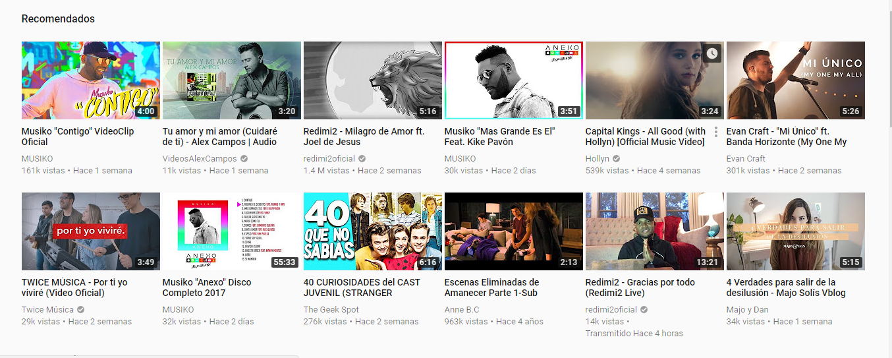
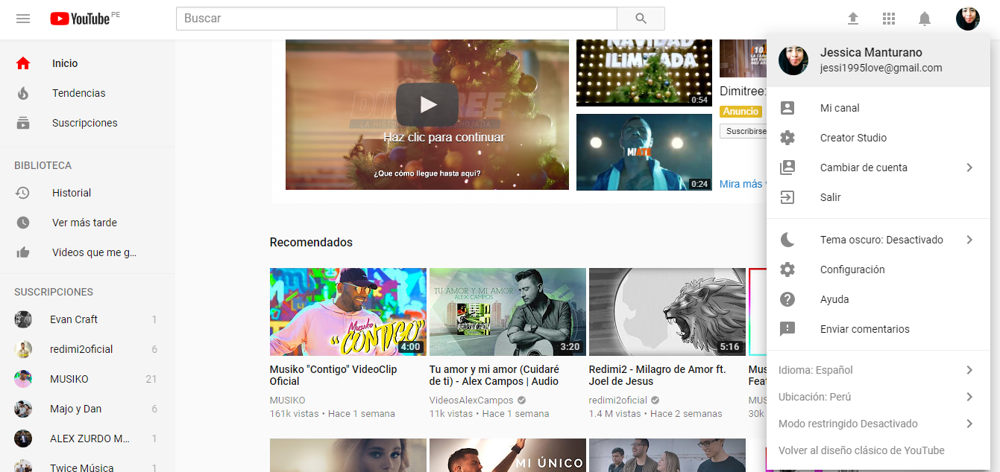

# **Pinterest**

### Ux

* Que pueda buscar rápidamente cualquier cosa y me aparecen imagenes relacionados a ello.

* Que me sugiera imagenes relacionadas a lo que busqué o temas parecidos basadas en mi historial

* Que al hacer click la imagen se agrande y  me permita ver la mejor y me de mas opciones respecto a ella.

### Ui

* Diseño de los botones
* Diseño del menú
* La lupa q aparece al posicionarte encima de la imagen que te permite ingresar a la imagen q te interesa y encontrar informacion que te interesa
* La forma, tamaño y colores de las imagenes que te salen en la búsqueda.
* Las notificaciones que te aparece al lado izquiero de la pantalla.

# **Youtube**

### Ux

* Las recomendaciones de posibles videos que podrian gustarte deacuerdo a tu historial.

* Al posar el mouse sobre el video tiene un efecto de hover en la q te da un pequeñoo resumen de el video clip

* También te muestra un menú desplegable al lado izquierdo con diferentes opciones que facilitan la búsqueda.

### Ui

* Diseño de los botones
* Diseño del menú(desplegables)
* Los hovers de los videos
* La navegacion infinita al igual q las redes sociales.

***
